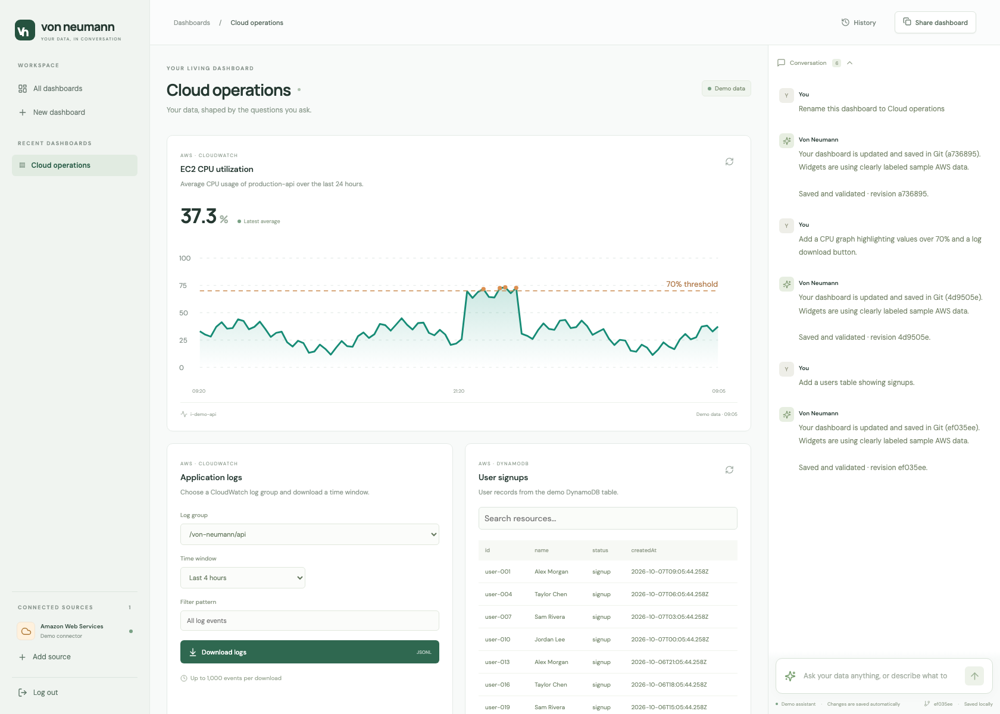
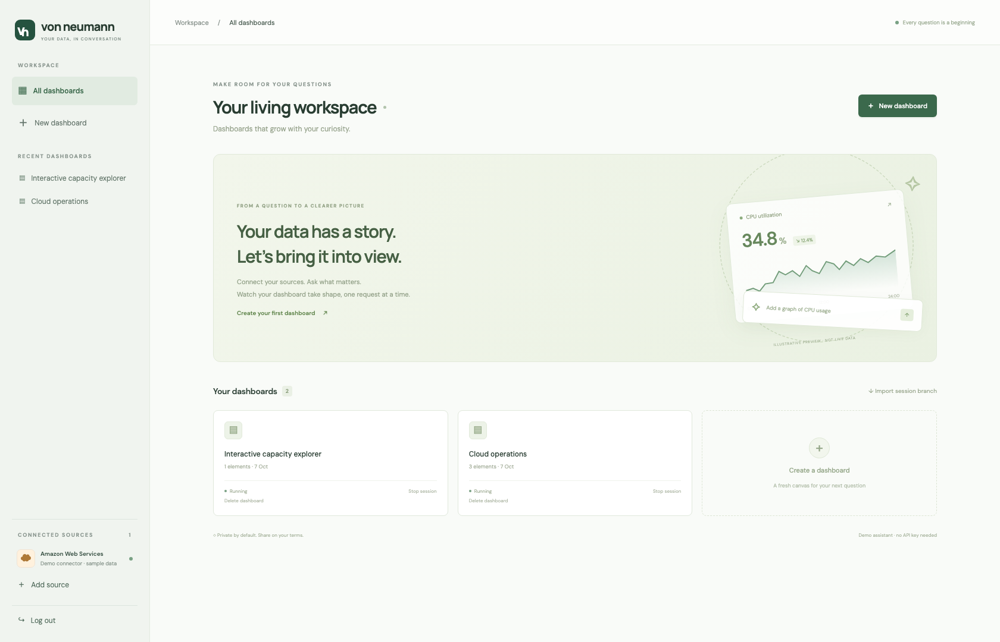
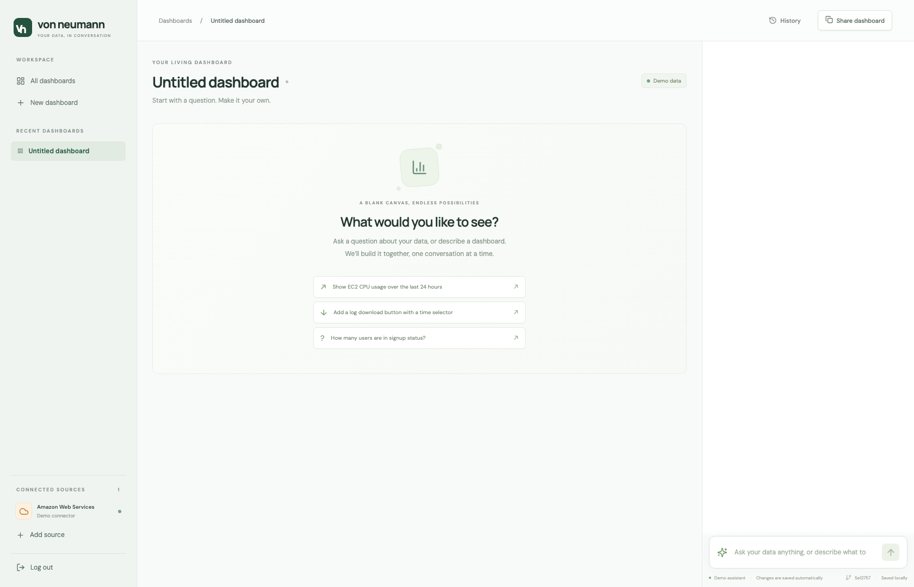
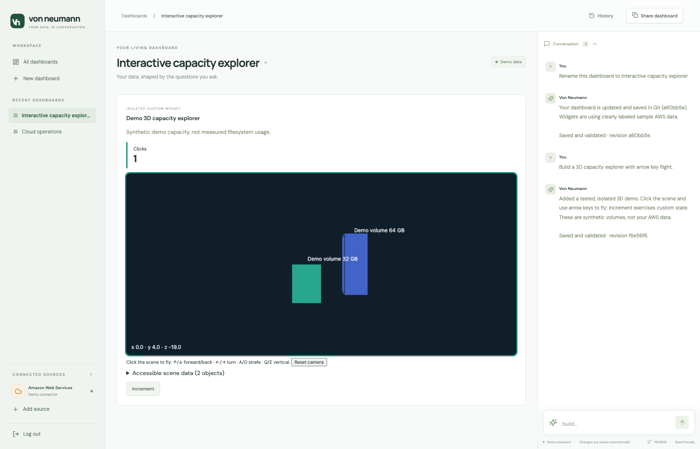
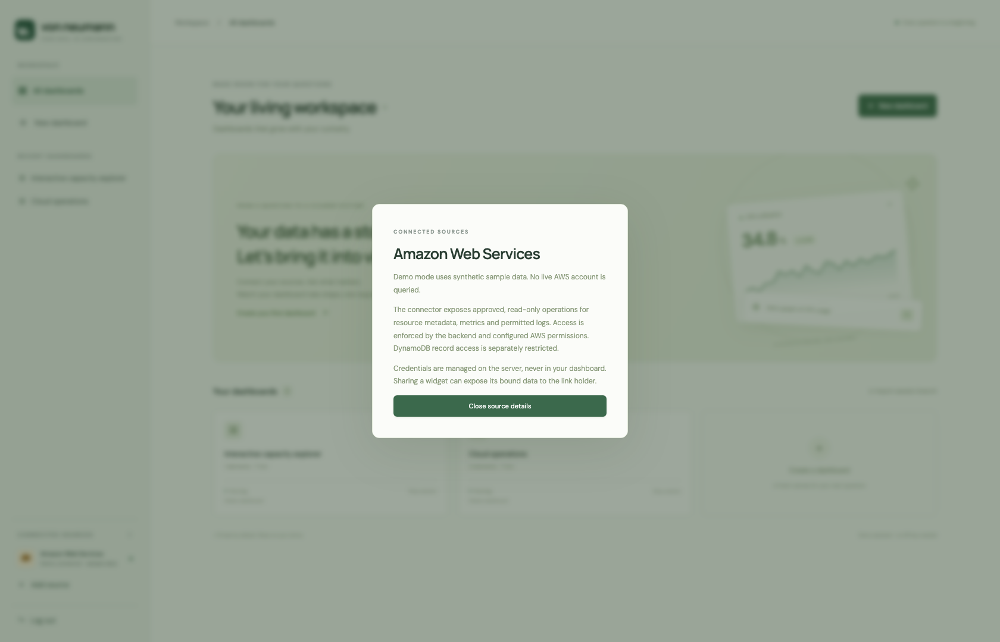

# Building a dashboard that can change itself

Most dashboards begin with someone deciding which questions other people will ask. They choose the charts, wire up the queries, arrange the page and ship it. Every new question then becomes another feature request.

For an innovation-day project, I wanted to turn that around. What if the question came first, and the dashboard grew out of the conversation?

“What is the CPU usage?” should produce an answer. “Keep a graph of it here, and highlight the spikes” should change the interface. And a more adventurous request—“let me fly through a 3D view of storage capacity”—should have somewhere to go beyond a polite refusal.

The result is **Von Neumann**: a conversational dashboard with a stable application shell, a read-only data gateway, versioned dashboard sessions and two ways to build UI. The interesting part is not just connecting a language model. It is deciding which powers the model should have, and which responsibilities must stay in ordinary application code.

*All screenshots in this article are captures of the actual application in its deterministic demo mode. Data, resource labels and conversations are synthetic. They do not expose a real account or represent live model outputs.*

## One platform and many small applications

The project is split into two repositories. The **platform** owns authentication, data access, the agent loop, session management, persistence and deployment. The **dashboard template** owns a single-page Next.js application: the empty canvas, trusted widget components and the permanent chat interface.

Creating a session clones the template into a dedicated workspace and creates a session branch. In the Docker deployment, the platform starts an isolated container for that workspace. A reverse proxy routes the session URL to its Next.js development server, including hot-reload WebSockets.

Development mode is deliberate here. When a validated dashboard change updates the session's source, the browser can see it without a full application release. It is also a trade-off: these servers belong behind the authenticated proxy, never on directly exposed public ports.

The platform remains the control plane. Individual dashboards do not receive cloud credentials, the Docker socket or the ability to create other sessions. Their dependencies come from the prepared template image; a request does not trigger arbitrary package installation.

```mermaid
flowchart TD
    U[Browser: dashboard and chat] --> P[Authenticated platform and reverse proxy]
    P --> A[Agent harness]
    A <--> M[Configured language model]
    A --> D[Typed connector gateway]
    U -->|Authenticated widget queries| D
    D --> C[Read-only cloud APIs]
    A --> V[Validate dashboard changes]
    V --> G[Session workspace and Git branch]
    G --> N[Isolated Next.js session]
    P --> N
    N -->|Hot reload| U
    P --> S[SQLite: chat, metadata, audit and sharing]
    V --> Q[Isolated custom-code tests]
```

The arrows are important. The model proposes actions through tools; it does not directly control the cloud account or the host shell. The application decides whether those actions are valid.

## A connector is more than credentials

An early limitation was revealing. Asking for resources grouped by CloudFormation stack did not work, even though the underlying AWS identity could read them. The model could only see the small set of operations the connector exposed.

Credentials answer **“what may this identity access?”** A tool contract answers **“what can this application ask for?”** Both must support the task.

The connector consequently grew into a catalogue of explicit, typed read operations: stack resources, compute, networking, databases, containers, logs, metrics, audit events and other service inventories. Each operation maps to a known SDK action. There is no generic “execute whatever AWS command the model writes” escape hatch.

The gateway validates resource and region scope, follows pagination within limits, and reports partial results. Inventory and metrics are separate from reading application records. Being allowed to list every DynamoDB table does not automatically mean being allowed to scan their contents. Reading logs is also a deliberate permission decision, because logs may contain sensitive data.

This boundary improves answers as well as security. The assistant can discover resource identifiers rather than asking the user to type them. It can also explain the limits of a result: a partial inventory is not a complete audit, sampled CPU is not instantaneous utilization, and provisioned disk capacity is not measured filesystem usage.

## Answers and edits are different outcomes

A prompt enters a bounded tool loop. The harness supplies the current dashboard, recent conversation and available capabilities. The model can inspect state, query data, propose an edit or ask for clarification. It can make multiple tool calls, but it does not receive an unrestricted terminal or filesystem agent.

Sometimes the right result is just a message. A question about current CPU should not unexpectedly fill the page with new widgets.

When the user asks for an interface change, prose is not enough. The backend needs a saved result. Standard edits go through schema validation, connector checks, source generation and TypeScript validation before being committed to the session branch. Failed validation restores the prior source. A failed remote push is reported separately from a successful local commit.

That distinction addresses a particularly frustrating failure mode: an assistant saying “I've added the graph” when nothing changed. Completion should be grounded in the saved dashboard revision, not in how convincing the final sentence sounds.

## Two ways to build the interface

The first path is intentionally boring: a validated widget specification. Charts, metric cards, tables, notes and log-download controls use trusted components. A graph with several instances has separate queries for each series, rather than trying to squeeze multiple identifiers into a single metric dimension.

This path is predictable, testable and easy to restore from Git. But a fixed widget vocabulary eventually becomes a ceiling. A 3D explorer or a stateful custom interaction needs more expressiveness.

The second path allows **untrusted JavaScript within a small rendering contract**. The agent drafts a widget, tests it, revises it when necessary and publishes it. Drafts are separate from the live dashboard and tied to a base revision, so an old draft cannot silently overwrite newer work.

Custom source is stored as an inert string, not imported as a React component or executed by the platform's JavaScript engine. A fresh QuickJS/WebAssembly interpreter receives input JSON and returns output JSON. The output can describe cards, bars, tables, buttons or a bounded 3D box scene. The trusted renderer turns that description into UI and implements keyboard flight.

The interpreter does not expose Node, the DOM, cloud credentials, network access or a dependency loader. Backend tests run inside disposable, resource-limited Docker containers. Browser execution uses a worker, a fresh interpreter and execution limits. Both input and output are bounded; rendering rejects arbitrary HTML, URLs, styles and executable callbacks.

This is a narrower capability than “build any web application.” That is the point. The custom path expands what the dashboard can express without granting arbitrary browser or server authority. Supporting another visual primitive still requires an intentional change to the trusted renderer.

These layers reduce risk; they do not prove the absence of interpreter, browser, container or application vulnerabilities. The project remains a prototype for a trusted workspace, not an audited hostile-tenant platform.

## Git remembers the dashboard, not everything

Each session has its own branch. Accepted edits persist the dashboard specification and generated source. History can restore an earlier dashboard by making a new commit, preserving the trail rather than rewriting it.

Git is not the entire database. Conversations, session metadata, audit records and sharing state live in SQLite. Moving only a branch to another backend restores the dashboard definition, not all of that surrounding history. Backups therefore need both the Git data and the application database.

The default session remote is private local storage on the deployment's persistent disk. Publishing the two source repositories does not publish session branches. If remote session synchronization is enabled, its repository should remain private: even a dashboard specification can contain sensitive labels, queries or text.

Deletion is similarly explicit. Removing a dashboard stops its runtime, revokes sharing and moves it into recoverable Trash. It does not delete cloud resources, and it is not secure erasure.

## A chat interface still needs interface design

The initial interaction taught another lesson: a capable model does not rescue an awkward layout. If a long conversation pushes the dashboard off screen, the user loses the thing they are trying to change.

Dashboard and chat now scroll independently. The shell owns the composer, navigation, history and sharing controls; generated widgets cannot replace those foundations. The user can inspect a result while continuing the conversation, instead of alternating between two distant parts of one long page.

This is also why the application stays single-page within each session. The assistant is changing the contents of a workspace, not inventing a new navigation structure after every request.

The sidebar follows the same principle: remove decorative controls that do nothing, expose recent dashboards as real links, and make logout explicit. Connected sources sit at the bottom and open an explanation of the data boundary. “Add source” is honest about the current limitation rather than suggesting that an unfinished configuration flow already works.

## Deployment includes a way to turn it off

The AWS reference deployment uses two CloudFormation stacks. A foundation stack owns delegated DNS, private release artifacts and Secrets Manager entries. An application stack owns the dedicated Docker host, network, IAM role, encrypted persistent storage, logging and backups. TLS terminates at the proxy; administrative access uses Systems Manager rather than public SSH.

The host's temporary IAM identity authenticates the AWS connector and Bedrock. Secrets Manager holds configuration and application authentication secrets. Vertex AI is another supported provider, with its own identity setup. Provider changes do not remove the need for well-defined tools and validation.

The privileged part deserves emphasis: the trusted backend manages Docker, which gives it substantial authority over its dedicated host. Session containers do not inherit that authority. Password protection, restricted sharing, request limits, cloud permissions and runtime isolation serve different purposes; none replaces the others. Read-only data can still be sensitive, and model or query usage can still generate costs.

Finally, a prototype should have an off switch that is stronger than hiding its URL. Disabling this deployment stops the host, removes inbound network rules and installs a deny-all policy on the application role. Data stays available for a later restart. Enabling reverses the controls only after ownership and change-set checks.

That is a pause, not teardown: retained disks, backups, addresses, DNS and secrets can still cost money. An account administrator can also override the controls. But it makes the default end of an experiment concrete and verifiable rather than “I think the app is no longer reachable.”

## What the experiment demonstrated

The useful middle ground was neither a chatbot attached to three hardcoded buttons nor a general coding agent with the keys to the infrastructure. It was a conversational control plane with explicit data capabilities, validated standard widgets and a carefully bounded path for custom behavior.

The model proposes. The connector limits what it can read. Validation decides what can be saved. The renderer limits what can run. Git makes changes inspectable and recoverable. And the deployment has an operational lifecycle, including a verified stopped state.

That combination makes a dashboard feel adaptable without pretending that an AI-generated change is automatically correct or safe.

For setup, operational commands and limitations, see the [platform README](../README.md). Screenshots can be reproduced with `node scripts/documentation-screenshots.mjs` after installing both repositories' dependencies and Playwright Chromium. The capture script creates an isolated demo workspace, drives real prompts and interactions, and stops its temporary server when finished.
